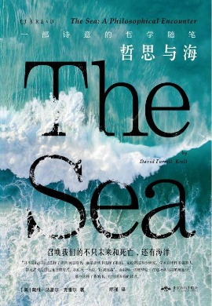
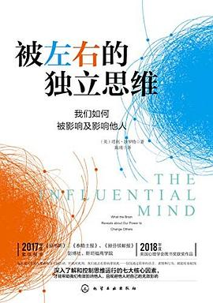
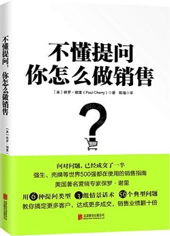

Before I started my Ph.D. program at Penn State, I had worked as a professional English-Chinese translator and published 6 solo translated books relating to philosophy, psychology, communication, and business. You can follow my work on [Douban](https://book.douban.com/author/4616298/).

### Philosophy

### Psychology

### Communication

### Business & marketing

